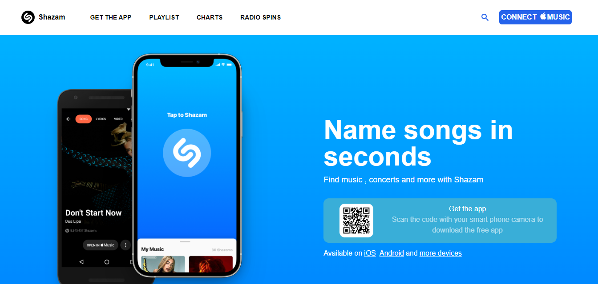
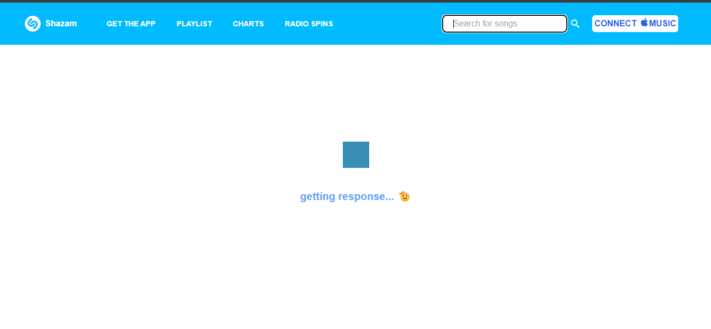
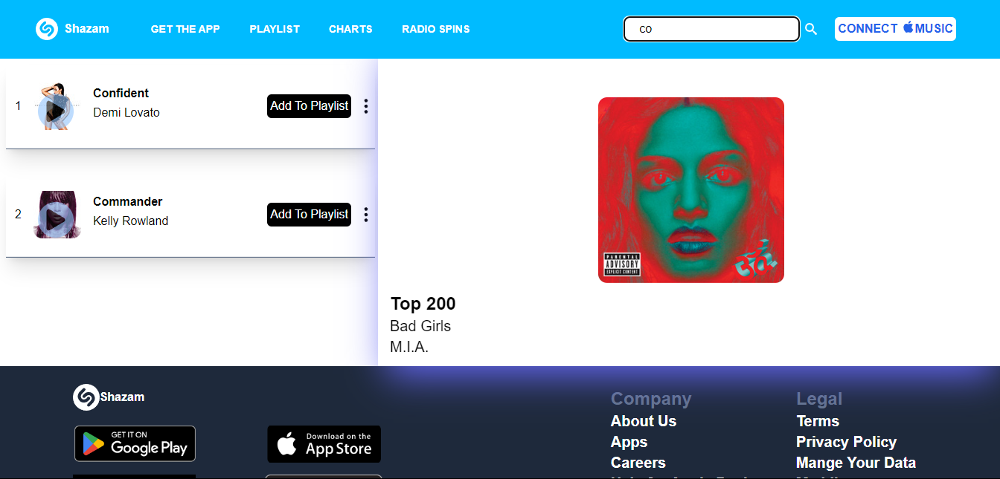

# Shazam Music App Clone



## Description

Welcome to the Shazam Music App Clone! This project is a replica of the popular Shazam app, designed to identify music playing around you. Built using modern web technologies, it showcases key features like music recognition, a sleek user interface, and seamless user experience. This clone aims to provide a similar look and feel to the original Shazam app while offering a great opportunity to explore and understand the functionalities behind music recognition apps.

## Features

- **Music Recognition**: Identify songs playing in your surroundings.
- **User Interface**: Clean and intuitive design inspired by the Shazam app.
- **Real-time Processing**: Quickly process and identify songs with high accuracy.
- **Search History**: Keep track of all your identified songs.
- **Responsive Design**: Optimized for both desktop and mobile devices.

## Technologies Used

- **Frontend**: React, TailwindCSS
- **Backend**: Node.js, Express
- **APIs**: Music recognition API
- **Database**: MongoDB

## Installation

1. **Clone the repository**:
    ```bash
    git clone https://github.com/yourusername/shazam-clone.git
    ```
2. **Navigate to the project directory**:
    ```bash
    cd shazam-clone
    ```
3. **Install dependencies**:
    ```bash
    npm install
    ```
4. **Start the development server**:
    ```bash
    npm start
    ```

## Usage

1. Open your browser and navigate to `http://localhost:5173`.
2. Click on the microphone icon to start listening for music.
3. Wait for the app to identify the song and display the results.

## Screenshots


*Description: The home screen of the Shazam clone.*


*Description: The app is listening and trying to identify the song.*


*Description: The app displays the identified song details.*

## Contributing

Contributions are welcome! Please fork the repository and create a pull request with your changes.

## License

This project is licensed under the MIT License. 
